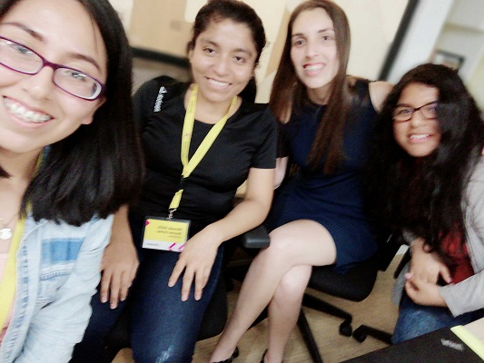
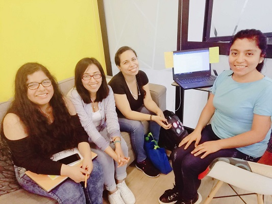
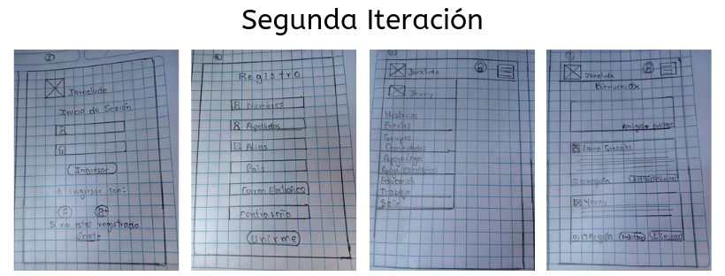
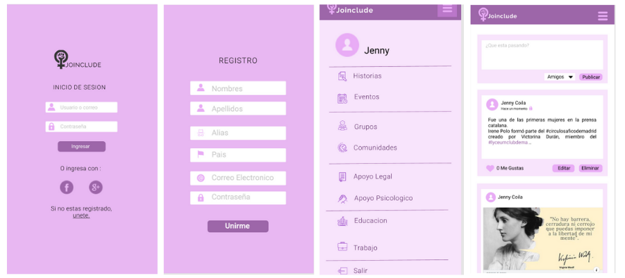

## Preámbulo

Instagram, Snapchat, Twitter, Facebook, Twitch, Linkedin, etc. Las redes
sociales han invadido nuestras vidas. Las amamos u odiamos, y muchos no podemos
vivir sin ellas.

Hay redes sociales de todo tipo y para todo tipo de intereses. Por ejemplo,
en una ronda de financiamiento con inversionistas, se presentó una red social
para químicos en la que los usuarios podían publicar artículos sobre sus
investigaciones, comentar en los artículos de sus colegas, y filtrar artículos
de acuerdo a determinadas etiquetas o su popularidad, lo más reciente, o lo
más comentado.

## Introducción

Una emprendedora nos ha encargado crear una red social. No nos da mucho detalle
sobre qué tipo de red social quiere, sólo nos dice que creemos la mejor que
podamos, y que luego la convenzamos de lanzarla al mercado. Nos da ciertos temas
en los que le gustaría invertir:

* Alimentación
* Feminismo
* Educación
* Salud
* Energías Renovables

## Objetivos de Aprendizaje

El objetivo principal de aprendizaje de este proyecto es construir una
[Single-page Application (SPA)](https://es.wikipedia.org/wiki/Single-page_application)
[_responsive_](https://github.com/Laboratoria/curricula-js/tree/master/topics/css/02-responsive)
 (con más de una vista / página) en la que podamos **leer y escribir datos.**

Dicho en palabras sencillas, aprenderás a:

* Aplicar y profundizar todo lo que aprendiste en el proyecto anterior.
* Entender las necesidades de los usuarios para los que crearás el producto y
  que ayudarás a resolver.
* Poner en juego tu creatividad para generar ideas que lleven a una solución
  original y valiosa del problema.
* Contar con el apoyo de tus compañeras, debes trabajar en equipo buscando
  _feedback_ constante.
* Definir como crear la estructura de tu propia data y de qué forma mostrarla en
  el producto.

## Consideraciones generales

Este proyecto se debe "resolver" en tríos.

La lógica del proyecto debe estar implementada completamente en JavaScript (ES6+),
HTML y CSS :smiley:. Para este proyecto no está permitido utilizar
frameworks o librerías de CSS y JS.

## Definición del producto

Dado que en el entorno social donde nos desenvolvemos las redes sociales forman parte de nuestra vida se genera la necesidad de usarlas para estar conectados con las personas, así como con entidades privadas y públicas.

En las redes sociales se abarcan diversidad de tema por eso vimos oportuno crear una red social orientado a personas feministas o que buscan la equidad de género. En esta esta Red Social Joinclude se podrá compartir ideas, historias relacionadas al feminismo  para llegar a ser una comunidad fuerte que genere impacto social en el mundo. 

* ¿Quiénes son los principales usuarios de producto?
   Los usuarios principales son personas feministas.
   Los usuarios secundarios personas que anhelan y buscan la equidad de género.

* ¿Cómo descubriste las necesidades de los usuarios?
   Dado altos índices de violencia hacia la mujer que diariamente informan los medios de comunicación y la falta de equidad de los derechos y oportunidades en los diversos roles que podría desempeñar la mujer, así como los pocos espacios que impulsen un cambio a esta mentalidad que persiste desde hace muchos años, creemos oportuno crear la red social JOINCLUDE.
      
   Así mismo durante las entevistas pudimos recabar información para conocer y descubir las secciones que quisieran ver para una red social orientada a personas feministas o que buscan la equidad de género, conociendo aún más sus necesidades.

* ¿Qué problema resuelve el producto para estos usuarios?
  Sirve de medio para que las personas puedan compartir sus historias o hechos vividos para que más gente lo conozca y puedan recibir apoyo y de esa forma se aporte en reducir los actos violencia, feminicidio o discriminación.

* ¿Cuáles son los objetivos de estos usuarios en relación con el producto?
  Los usuario podrán compartir post acerca de temas relacionados al feminismo y equidad de género.

* ¿Cuáles son las principales funcionalidades del producto y cuál es su prioridad?
  Los usuarios podrán publicar, editar, eliminar, dar like a al post, así también el usuario podrá elegir si el post será público o privado.

* ¿Cómo verificaste que el producto les está resolviendo sus problemas?
  La verificación se hizo a través de la iteración de los prototipos de baja fidelidad.
 
* ¿Cómo te asegurarás que estos usuarios usen este producto?
   Luego de las entrevistas y con toda la información recabada creamos sketchs plasmando de la mejor manera posible los requerimientos que quisieran ver y hacer en la red social, luego le pedimos a los usuarios objetivo que nos den feedback de qué tán intuitivo y fácil de usar era este prototipo y qué se podría mejorar, esto lo hicimos 3 veces para de esa forma asegurarnos de atender la necesidad del usuario.

## Entrevista
 Antes de elaborar las preguntas para la entevista definimos nuestro público objetivo de acuerdo al tema elegido, "El feminismo" en tal sentido la entrevista fue dirigida a personas que se consideran feministas y/o que buscan la equidad de género.
 y con la finaliad de representar todo lo que el usuario necesitaría ver o hacer en nuestro producto elaboramos las siguientes preguntas:

1. ¿Cuál es la red social que más usas? ¿por qué?
   La red social que más uso es Facebook, porque:
    * Puedes discutir diferentes propuestas feministas.
    * Denunciar casos de violencia, publicidad machista, casos de desigualdad.
    * Conectarse con personas que tienen las mismos intereses.
    * Compartir noticias es más dinámica que en otras redes sociales.

2. ¿De las redes sociales que utilizas qué te gustaría mejorar?
    * Que en Facebook se pueda categorizar la información para que me sirva en el día a día.
    * Desde el punto de vista del feminismo la seguridad no está garantizada, hay muchísimo ciberbulling, ataque de trolls, mucha    violencia. Le gustaría que regulen la violencia gráfica, Facebook practicamente no hace nada.

3. Cuéntame una experiencia impactante.
    * Negativa: los trollers, cuando te dicen que deben matar a la feminazis.	 
    * Positiva: Se crearon grupos de Facebook, a partir de la marcha del 13 de agosto, donde   muchas chicas contaron sus historias de violencia a la cual también se unieron chicas que brindaron apoyo y se pusieron en contacto con psicólogas.

4. ¿Cuál es el contenido que más buscas en las redes sociales?
    * Buscar instituciones u organizaciones que postean información interesante.
    * Información de eventos.
    * Información de talleres.

5. ¿Qué contenido te gustaría que tenga la red social?
    * Asesoría legal de alguien enfocadx en redes sociales, ya que hay mucho acoso.
    * Asesoría psicológica.
    * Comunidades.
    * Lugares de encuentro que sean certificados y que garantice seguridad, donde se puedan congregar personas que sigan el mismo ideal.
    * Que haya links a otras instituciones públicas (ministerio de la mujer, comisarías, ministerio público, defensoría del pueblo) ya que hay mujeres feministas que no saben que hay canales de atención informativos.
    * Becas de estudio.
    * Trabajo.

  Fotos con nuestras entrevistadas.
  ------------------------------
  

  

  

  Luego de recabar información proseguimos a plantear las historias de usuario.

## Historias de usuario
    A continuación las historias de usuario de la red social Joinclude.
    
  **Historia 1: registroUsuario**
  **Yo como:** Usuario de la Red Social
  **Quiero:** quiero registrarme con mis datos (usuario, alias, contraseña, nombre, apellidos, edad país).
  **Para:** ser miembro de la Red Social.
  **Definición de terminado:** el usuario podrá registrar sus datos en un formulario que contenga input y pueda dar clic en el botón registrar.

  **Historia 2: verificaciónCorreoDeRegistro**
  **Yo como:** Usuario de la Red Social.
  **Quiero:** podré recibir un correo electrónico de verificación a mi bandeja.
  **Para:** confirmar mis datos de registro.
  **Definición de terminado:** Que el usuario pueda recibir un enlace a su bandeja de correo y pueda dar clic para validar su correo y le muestre una ventana emergente que diga: Su correo ha sido validado.

  **Historia 3: inicioSesionNormal**
  **Yo como:** Usuario de la Red Social
  **Quiero:** iniciar sesión con mi correo electrónico y contraseña que ingresé en mi formulario de registro.
  **Para:** para brindarle una capa de seguridad para acceder a información y contenido de mi cuenta.
  **Definición de terminado:** que el usuario ingrese usuario y contraseña en inputs y pueda dar clic en el botón ingresar para acceder al contenido de su cuenta de Feminist.

  **Historia 4: inicioSesionGoogle**
  **Yo como:** Usuario de la Red Social
  **Quiero:**  usar mi cuenta de Google para iniciar sesión a Feminist.
  **Para:** brindarle una capa de seguridad para acceder a la información y contenido de mi cuenta.
  **Definición de terminado:** que el usuario haga clic en el icono de Google para que inicie sesión y acceda al contenido de su cuenta en Feminist.

  **Historia 5: inicioSesionFacebook**
  **Yo como:** Usuario de la Red Social
  **Quiero:**   usar mi cuenta de Facebook para iniciar sesión a Feminist.
  **Para:** brindarle una capa de seguridad para acceder a la información y contenido de mi cuenta.
  **Definición de terminado:**  que el usuario haga clic en el icono de Facebook para que inicie sesión y acceda al contenido de su cuenta en Feminist.

  **Historia 6: cerrarSesion**
   **Yo como:**  Usuario de la Red Social
  **Quiero:**  cerrar sesión de mi cuenta.
  **Para:**  evitar que las  personas ingresen a una cuenta de otro usuario.
  **Definición de terminado:** que el usuario pueda hacer clic en el botón salir del menú principal.

  **Historia 7: publicarPost**
  **Yo como:**  Usuario de la Red Social
  **Quiero:**  postear en mi muro.
  **Para:** mostrar información de mi interés
  **Definición de terminado:** que cada vez que el usuario haga click en el botón publicar se agregue el post en el muro del usuario, uno debajo de otro. Usando la base de datos Firestore.

  **Historia 9: validaciónPost**
  **Yo como:**  Usuario de la Red Social
  **Quiero:** que no pueda publicar un post vacío.
  **Para:**  evitar  post vacíos en el muro de la red social
  **Definición de terminado:** Si el textarea del post se encuentra vacío se bloqueará el botón de publicar para así no poder publicar un post vacio.

  **Historia 10: eliminarPost**
  **Yo como:**  Usuario de la Red Social
  **Quiero:** eliminar un post específico.
  **Para:** poder eliminar de mi muro los post que ya no quiera.
  **Definición de terminado:** Al apretar el botón eliminar post al usuario se le alerte antes de eliminar el post.

  **Historia 11: contadorLikes**
  **Yo como:**  Usuario de la Red Social
  **Quiero:** ver la cantidad de like que tiene su post.
  **Para:** saber cuántos like tienen mis post.
  **Definición de terminado:** Al apretar el botón like, debe sumar un like a la publicación y que el usuario pueda visualizarlo.

  **Historia 12: editar Post**
  **Yo como:** Usuario de la Red Social
  **Quiero:** editar un post específico.
 **Para:** poder editar de mi muro los posts que quiera
  **Definición de terminado:** Al presionar el botón editar, este cambie a guardar y el post se pueda editar.

  **Historia 13: ver y publicar post Públicos y Privados**
  **Yo como:**  Usuario de la Red Social
  **Quiero:** Asignar  y saber si un post es público o privado
  **Para:** poder ver los post que son públicos y los que solo pueda ver yo como usuario.
  **Definición de terminado:**  El usuario pueda seleccionar si el post a publicar sea público o privado, pueda ver los post públicos de otras personas y solo el usuario pueda ver sus post privados. 

## Diseño de la Interfaz de Usuario (prototipo de baja fidelidad)

Luego de las entrevista  realizamos sketchs de cómo sería el producto teniendo en cuenta la necesidad principal del usuario.

* Primera iteración

* Segunda Iteración

## Diseño de la Interfaz de Usuario (prototipo de alta fidelidad)

El producto desarrollado sigue los lineamientos de diseño de la interfaz de usuario.

